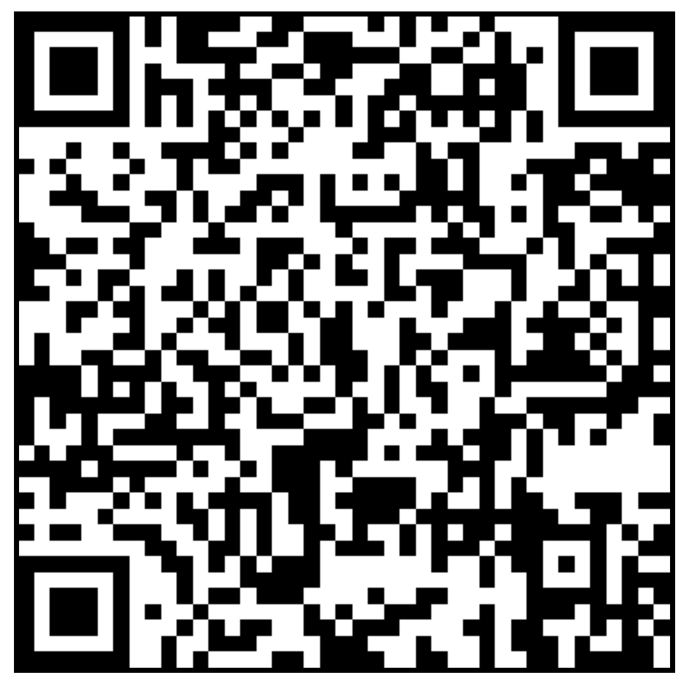
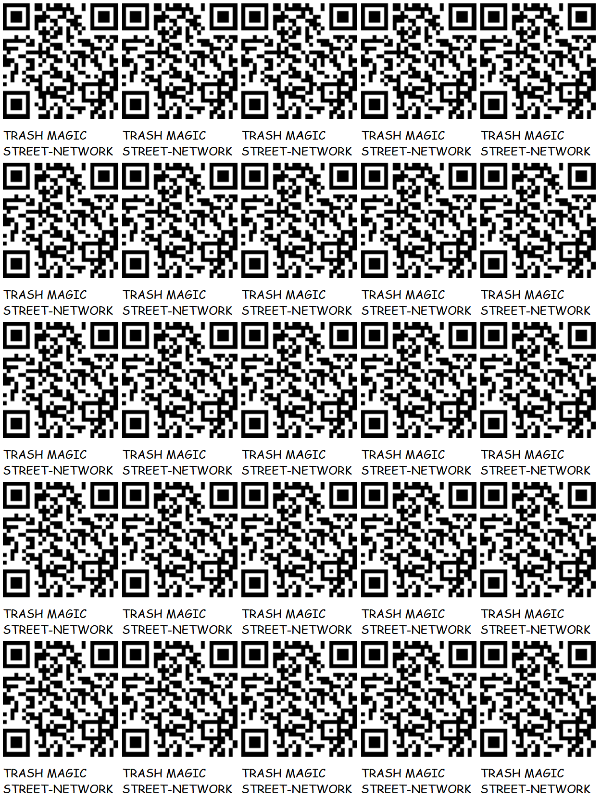

### [http://localhost/STREET-NETWORK/readme.html](http://localhost/STREET-NETWORK/readme.html)

# [STREET-NETWORK REPOSITORY](https://github.com/LafeLabs/STREET-NETWORK)

WE SPREAD CARDBOARD HYPERTEXT ALONG THE STREET NETWORK TO EXTEND THE ORGANIC WEB INTO THE PHYSICAL WORLD!

 - [STREETS](https://en.wikipedia.org/wiki/Street)
 - [HIGHWAYS](https://en.wikipedia.org/wiki/Highway)
 - [BUSES](https://en.wikipedia.org/wiki/Bus)
 - [TRAINS](https://en.wikipedia.org/wiki/Train)
 - [TRAIN STATIONS](https://en.wikipedia.org/wiki/Train_station)
 - [BUS STATIONS](https://en.wikipedia.org/wiki/Bus_station)
 - [BUS STOPS](https://en.wikipedia.org/wiki/Bus_stop)
 - [LIBRARIES](https://en.wikipedia.org/wiki/Library)
 - [ART GALLERIES](https://en.wikipedia.org/wiki/Art_gallery)
 - [HACKER SPACES](https://en.wikipedia.org/wiki/Hackerspace)
 - [PARKS](https://en.wikipedia.org/wiki/Park)
 - [BRIDGES](https://en.wikipedia.org/wiki/Bridge)
 - [TUNNELS](https://en.wikipedia.org/wiki/Tunnel)
 - [MUTUAL AID](https://en.wikipedia.org/wiki/Mutual_aid)